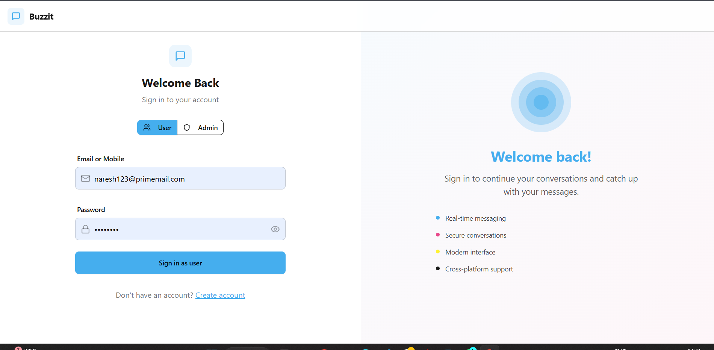
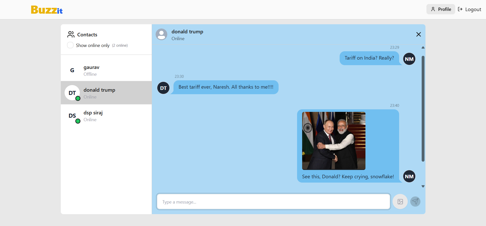

# 🚀 Buzzit – Full‑Stack Realtime Chat Application

Modern, fast, and role‑aware messaging app built with the MERN stack and Socket.io. Includes a complete Admin Dashboard for user management, secure JWT auth, file sharing, online presence, and a clean, responsive UI.





---

## ✨ Highlights

- Realtime 1:1 messaging with Socket.io (images, videos, and documents)
- Role‑based authentication (User/Admin) via JWT (httpOnly cookies)
- Admin Dashboard with full user CRUD (create, read, search, update, delete)
- Online users presence and live updates
- Modern, accessible UI with TailwindCSS + DaisyUI
- Global state management with Zustand
- Soft delete support (mark users inactive) and hard delete option (admin)
- Production‑ready Express server serving frontend (Vite build)
- Cloudinary uploads via Multer for media attachments

---

## 🧰 Tech Stack

- **Frontend**: React 18, Vite, Zustand, TailwindCSS, DaisyUI, React Router, Lucide Icons
- **Backend**: Node.js, Express.js, Socket.io
- **Auth**: JWT (httpOnly cookies), bcrypt password hashing
- **Database**: MongoDB + Mongoose
- **Storage**: Cloudinary (images, videos, files)
- **Build/Tooling**: Vite, ESLint

---


## 👑 Admin Dashboard

Accessible only to admins at `/admin` after login. Features:

- Create users (name, email, mobile, password, role)
- Search/filter users by name/email
- Read list of active users (optionally include inactive via API)
- Update users (name, email, mobile, role)
- Delete users (soft delete by default; hard delete endpoint also available)
- Admins are hidden from regular users’ contact lists
- Admins do not see any chat interface; they are redirected to the dashboard


Seed a default admin quickly:

```bash
cd backend
npm run create-admin


---

## 💬 Realtime Messaging

- Socket.io for realtime communication
- Online users list broadcast to connected clients
- Messages support:
  - Text
  - Images (preview)
  - Videos (inline playback)
  - Documents (links to download)
- Smooth autoscroll to newest message
- Modern bubbles: different colors for sent vs. received


Create `backend/.env` with:

```env
MONGODB_URI=your_monogo_uri_string
PORT=5000
JWT_SECRET=your_super_secret_jwt_key

CLOUDINARY_CLOUD_NAME=your_cloudinary_cloud_name
CLOUDINARY_API_KEY=your_cloudinary_api_key
CLOUDINARY_API_SECRET=your_cloudinary_api_secret

NODE_ENV=development
```

## 🧭 UX & UI

- Clean, eye‑comforting theme with modern colors
- Responsive layout for desktop and mobile
- Distinct message bubble colors (sent vs received)
- File/image/video previews in chat
- Role‑aware navigation: users see chat, admins see dashboard
- Avatars fallback to first letter of name (color‑coded)

---

## 🔒 Security Notes

- JWT in httpOnly cookies (mitigates XSS token theft)
- Passwords hashed with bcrypt
- CORS configured for local dev origin
- Admin routes require role‑based access
- Input validation for auth and admin user management

---

---

## 🗺️ Roadmap Ideas

- Group chats
- Message read receipts & typing indicators
- Push notifications
- Rich link previews
- Message reactions & replies
- Advanced admin analytics & bulk ops

---

## 📄 License

This project is licensed under the terms of the MIT License. See `LICENSE` for details.

---

## 🙌 Acknowledgements

Inspired by modern messaging UX patterns and the MERN + Socket.io ecosystem. Thanks to the open‑source community for the amazing tools that power Buzzit.
